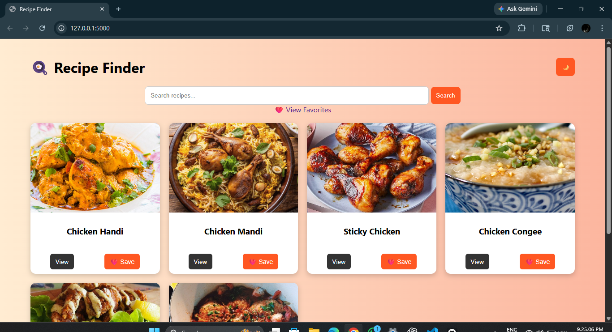
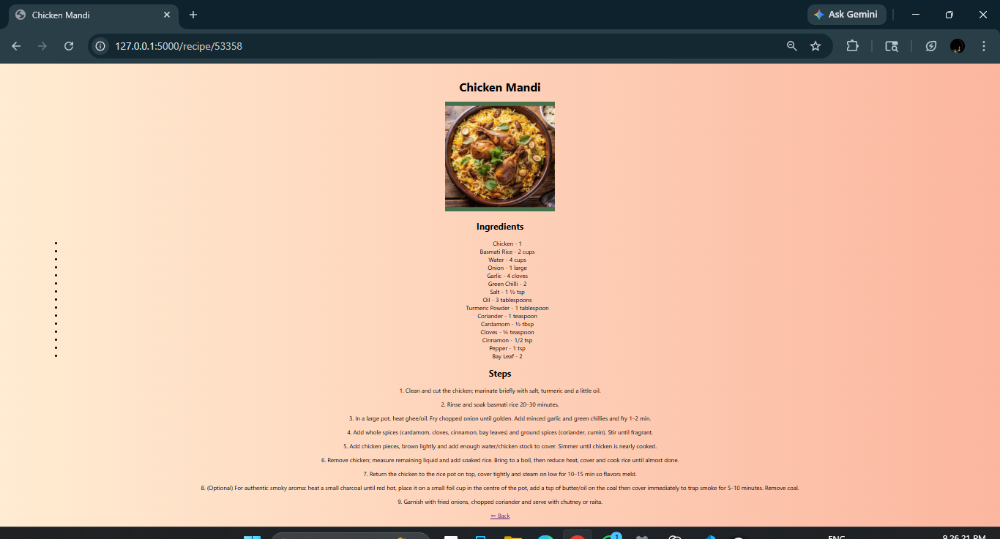
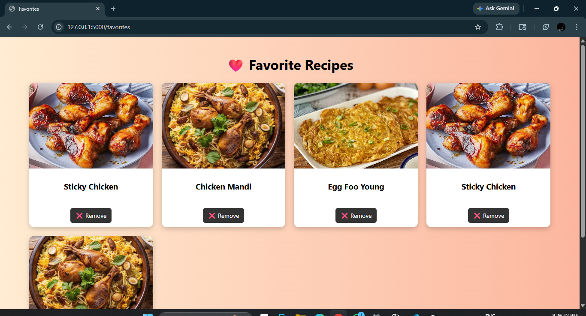

# 🍳 Recipe Finder App

A modern Recipe Finder web app built using Flask.
Search, explore, and save your favorite recipes from around the world 🌍

---

## ✨ Features

* 🔍 Search recipes by name or ingredient
* 📖 View detailed cooking instructions
* ❤️ Save your favorite recipes
* 🌙 Dark mode support
* ⚡ Fast and simple UI

---

## 🛠 Tech Stack

* **Backend:** Python (Flask)
* **Frontend:** HTML, CSS
* **Database:** SQLite
* **API:** TheMealDB

---

## 📁 Project Structure

```
recipe-app/
│
├── app.py
├── requirements.txt
├── README.md
│
├── templates/
│   ├── index.html
│   ├── detail.html
│   └── favorites.html
│
├── static/
│   └── style.css
```

---

## ▶️ How to Run Locally

### 1️⃣ Install dependencies

```
pip install -r requirements.txt
```

### 2️⃣ Run the app

```
python app.py
```

### 3️⃣ Open in browser

```
http://127.0.0.1:5000
```

---

## 📸 Screenshots

### 🏠 Home Page



### 📖 Recipe Details



### ❤️ Favorites Page



---

## 🚀 Future Improvements

* 🔐 User authentication system
* ⭐ Rating system
* 🧠 Smart search suggestions (AI-based)
* 🌐 Deploy as live website

---

## 🙌 Author

* 👨‍💻 Kamalesh

---

## ⭐ Support

If you like this project, give it a ⭐ on GitHub!
